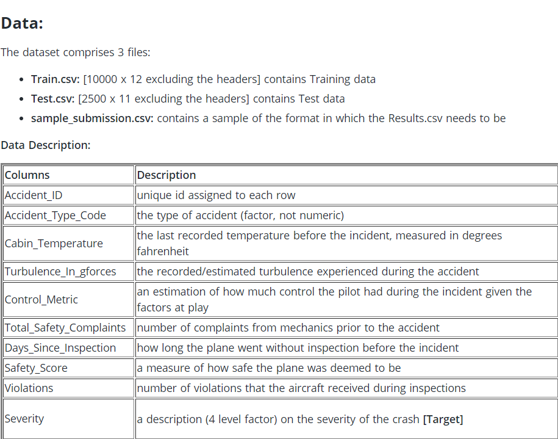

# Flight-Crash-Severity-Prediction

## Introduction
I participated in a Data Science Hackathon on Hackerrank taken by more than 10,000 people and ended up being in top 100 in the leaderboard. This repository contains my approach to the problem.

## The Problem Statement
Imagine you have been hired by a leading airline. You are required to build Machine Learning models to anticipate and classify the severity of any airplane accident based on past incidents. With this, all airlines, even the entire aviation industry, can predict the severity of airplane accidents caused due to various factors and, correspondingly, have a plan of action to minimize the risk associated with them.

## The Dataset

## Evaluation Criteria

score = {100 * (f1\_score(actual\_values, predicted\_values, average='weighted'))}

## Top 1% Approach

1. Using Random Forest(with complete hyperparameter tuning) on the data as it is without feature engineering, give an f1 score of 0.954 which is already pretty impressive.
2. Learning Curves show us that the model is overfitting, gathering more training is not possible so we should focus on feature engineering and feature reduction.
3. Some EDA on data shows that train and test dataset belong to the same distribution hence K-Fold Cross Validation would effectively serve good for validation.
4. The labels class is imbalenced undersampling or oversampling might help in a general case, but they didn't prove to be useful in this case.
5. Some more EDA, revealed feature interactions and dependencies which helped me remove useless and redundant features and create new and useful features.
6. Ensembling somewhat diverse algorithims like Random Forest, K-Nearest Neighbours, XGBoost, Multi Layer Perpetron and LightGBM helped me obtain f1 score around 0.97.
